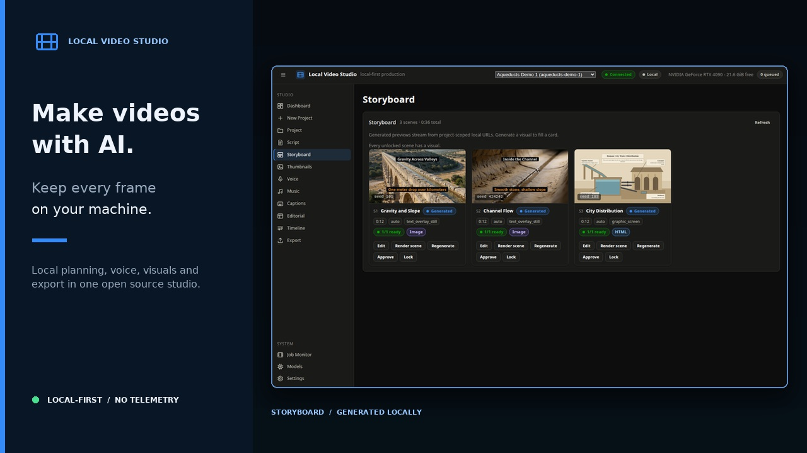
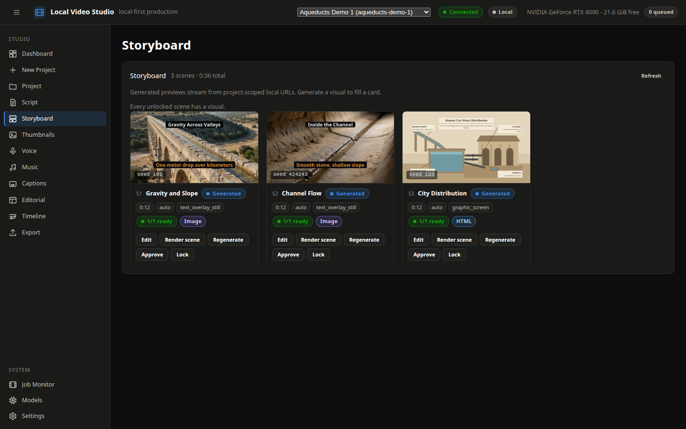
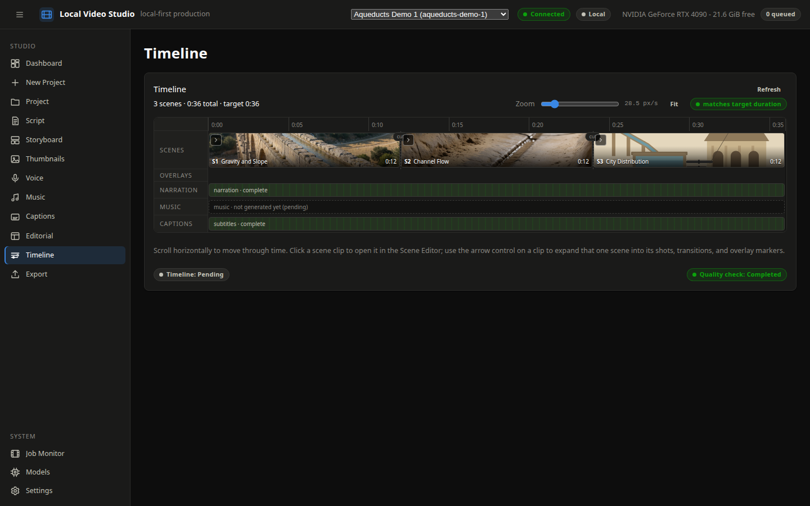

# Local Video Studio

**Create complete AI videos on your own hardware, inspect every stage, and restart only the work that needs changing.**

[](https://github.com/awesomecon/local-video-studio/actions/workflows/ci.yml)
[](https://github.com/awesomecon/local-video-studio/releases)
[](docs/installation.md)
[](LICENSE)
[](https://www.producthunt.com/products/local-video-studio?launch=local-video-studio)

[](docs/assets/launch-demo.mp4)

**[Watch the 73-second launch demo](docs/assets/launch-demo.mp4)** · [Install the core studio](docs/installation.md) · [Explore model backends](docs/models.md)

The demo was planned, voiced, illustrated, captioned, and rendered with local backends. Local Video Studio is local-first and has no telemetry. The optional Gemini TTS provider is the only cloud path: it sends narration text and an optional delivery direction to Google only when you select it and start a generation with your own key.

> If private, restartable creative tooling is useful to you, consider starring the repository. It helps other local-AI builders find the project.

## Why Local Video Studio?

Most AI video workflows are a collection of scripts and model UIs. Local Video Studio turns them into one reviewable production pipeline:

- **Restart individual stages.** Regenerate a shot, narration take, thumbnail, timeline, quality check, or final render without throwing away unrelated completed work.
- **Keep a production record.** Prompts, negative prompts, seeds, model and workflow versions, settings, attempts, approvals, and file hashes remain recoverable.
- **Use the right tool for each scene.** Mix generated stills, controlled image motion, local audiovisual clips, exact-text graphic screens, imported media, overlays, and captions.
- **Render deterministically.** FFmpeg owns timing, assembly, transitions, subtitles, quality checks, and final MP4 output.
- **Keep projects portable.** Human-readable JSON, Markdown, media, subtitles, and renders live in ordinary project directories. SQLite is an index, not the only copy of your work.
- **Start without a GPU.** The complete deterministic mock pipeline runs without CUDA, model weights, API keys, or automatic downloads.

## See the workflow

| Storyboard: choose and review every scene | Timeline: inspect the assembled production |
| --- | --- |
|  |  |

A typical project moves through:

```text
Topic → script → scenes and shots → voice → visuals → captions and music
      → timeline → preview → quality check → final MP4 → thumbnails
```

Every completed stage is persisted. Approved or locked scenes are preserved, and downstream work is invalidated only when its inputs change.

## What it connects

Real-model integrations are optional and installed separately. The core application does not silently install AI packages or download weights.

| Production need | Available integrations |
| --- | --- |
| Planning and direction | An existing local OpenAI-compatible LLM server |
| Still images and image motion | Krea 2 Turbo, Qwen-Image-2512, and Ideogram 4 through isolated local services |
| Local audiovisual shots | MiniMax H3 |
| Exact text and information graphics | Local HTML/CSS/Chromium graphics and deterministic text compositing |
| Narration and voice cloning | Fish S2 Pro, IndexTTS 2.5, VoxCPM2, Chatterbox, Qwen TTS, OmniVoice, Breeze TTS 2, Higgs TTS 3, and other configured local services |
| Optional cloud narration | Gemini TTS, explicitly selected and key-gated |
| Music | ACE-Step through ComfyUI |
| Caption alignment | Faster-Whisper using locally stored weights |
| Editing and delivery | FFmpeg previews, QC, subtitles, final renders, frame extraction, and thumbnails |

Not every schema-level visual mode has a real backend wired yet. The current status is documented in [visual modes](docs/visual-modes.md), and each configured backend reports `available`, `unconfigured`, or `incompatible` with remediation instead of failing silently.

## Quick start: no models or GPU

This source-checkout path launches the browser UI in deterministic mock mode on macOS or Linux:

```bash
git clone https://github.com/awesomecon/local-video-studio.git
cd local-video-studio
python3.12 -m venv .venv            # Python 3.11 works too
.venv/bin/python -m pip install -e .
LOCAL_VIDEO_STUDIO_MOCK_MODE=1 .venv/bin/local-video-studio
```

Open the local URL printed by Uvicorn, normally `http://127.0.0.1:8009/`. There is no Node.js build step. The command binds to loopback, installs no model weights, and automatically selects another allowed local port if `8009` is occupied.

For Windows PowerShell, FFmpeg setup, environment checks, expected outputs, and a guided first render, use the complete [installation guide](docs/installation.md).

### Render a mock project from the CLI

```bash
.venv/bin/python -m backend.pipeline.cli \
  --topic "How Roman aqueducts worked" \
  --duration 30 \
  --resolution 640x360 \
  --output-root ./projects
```

The command prints the portable project directory and `renders/final.mp4`. Each CLI invocation creates a new project. In the web UI, rerunning an existing project keeps completed stages and rebuilds only missing or invalidated work.

## Requirements and platform support

- Python 3.11 or 3.12
- Git
- FFmpeg on `PATH`, unless an existing `imageio-ffmpeg` installation supplies its bundled executable
- ffprobe recommended for complete media quality checks
- NVIDIA/CUDA only for optional GPU model backends

The core studio is exercised in native CI on Ubuntu 24.04 with Python 3.11/3.12, Windows 2025 x64 with Python 3.12, and macOS 15 Intel with Python 3.12. Physical Windows/macOS testing, Apple Silicon, Windows ARM, packaged installers, and PyPI publication are not yet qualified. See [installation](docs/installation.md) and [cross-platform qualification](docs/cross-platform-qualification.md) for the exact status.

## GPU compatibility

GPU requirements depend on the optional backends you choose; they are not a requirement of the application itself.

| Hardware | Practical scope |
| --- | --- |
| CPU only | Full mock pipeline, browser UI, graphic screens, editorial overlays, thumbnails, caption alignment on CPU, and FFmpeg rendering |
| 8–16 GB GPU | Selected lighter narration, caption, and image backends depending on model, quantization, and free VRAM |
| 24 GB-class GPU | Reference configuration used to develop and test all currently connected local backends |
| Larger GPUs | The same backends with additional headroom; the studio does not cap larger cards |

The application checks system-wide free VRAM before heavy loads and serializes GPU-heavy jobs. It never stops an external local-LLM service to reclaim memory. Measured backend guidance and smaller-card alternatives are in [GPU memory management](docs/gpu-memory.md).

## Privacy and safety defaults

- Application services bind to `127.0.0.1` by default.
- Telemetry is not enabled.
- Model weights are never downloaded automatically.
- Secrets come from named environment variables or the local secret store and are redacted from logs and errors.
- Prompts, scripts, media, references, and voice samples remain local unless you explicitly use the Gemini TTS provider.
- Heavy model dependency conflicts belong in isolated workers instead of replacing your main CUDA/PyTorch environment.
- Port `1234` is reserved for an externally managed local LLM; the studio never starts, stops, or claims it.

Portable defaults live in `config/default.yaml`. Copy `config/local.example.yaml` to ignored `config/local.yaml` for machine-specific paths. Never store API keys in YAML.

## Documentation

- [Installation and first render](docs/installation.md)
- [Model backends](docs/models.md)
- [GPU memory management](docs/gpu-memory.md)
- [Architecture and trust boundaries](docs/architecture.md)
- [Example production workflow](docs/production-workflow.md)
- [Multi-shot scenes](docs/shots.md)
- [Rendering and final output](docs/rendering.md)
- [Troubleshooting](docs/troubleshooting.md)
- [API contract](docs/api-contract.md)

## Development and contributing

```bash
python -m pip install -e '.[dev]'
python -m pytest
python3 frontend/tests/static_checks.py
```

The `main` branch is protected. Create a focused feature, fix, or documentation branch and merge it through a pull request after the relevant checks pass. Automated tests never download model weights or contact non-local services. See [CONTRIBUTING.md](CONTRIBUTING.md), the [security policy](SECURITY.md), and the issue templates for ways to help.

The project is under active development. Start in mock mode and treat optional real-model setup as experimental until its backend-specific health check succeeds.

### Existing clones from before September 5, 2026

The `main` history was cleaned up without changing the code. If an older clone reports divergent branches, back up unpushed work, run `git fetch origin`, then reset your local `main` to `origin/main`.

## License

Local Video Studio's original source code and documentation are licensed under the [Apache License 2.0](LICENSE).

Model weights, third-party dependencies, ComfyUI custom nodes, fonts, media, and externally sourced materials retain their own licenses and usage restrictions. Review those terms separately before redistribution or commercial use.
